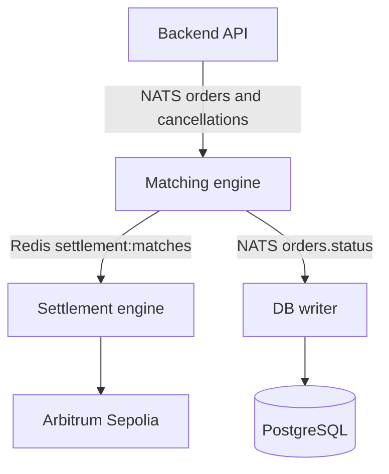

# Centuari Matching Engine

The matching engine is Centuari's standalone order-matching service. It receives
orders from `backend-v2` over NATS, matches them in memory using price-time
priority, publishes matches to Redis, and persists order and match state through
its database-writer process.

For the current protocol architecture and launch boundary, see the [Centuari
umbrella README](https://github.com/centuari-labs/centuari). The active launch
target is Arbitrum Sepolia (`421614`); this repository does not deploy contracts
or provide a frontend.

## Process model

This repository contains two cooperating processes. They use the same source
tree, but they have different responsibilities:

| Process | Command | Responsibility |
| --- | --- | --- |
| Matching engine | `pnpm run start:matching-engine` | Maintains in-memory order books, handles order/cancel/update messages from NATS, and publishes settlement matches to Redis. |
| DB writer | `pnpm run start:db-writer` | Consumes order-status messages from NATS and settlement matches from Redis, then writes them to PostgreSQL. |

The normal service command starts both processes:

```bash
pnpm start
```

The matching engine keeps database I/O off its hot path. Redis is used for the
`settlement:matches` stream consumed by `settlement-engine`; the DB writer has
its own Redis consumer group so it can persist the same matches independently.

This is an operational service, not a published installable package. Other
Centuari repositories communicate with it over NATS and Redis rather than
importing it as a dependency.

## Architecture



The order book uses `functional-red-black-tree` structures. Books are indexed
by loan token and maturity, with an order ID index for lookups; each order's
market slots carry the corresponding bytes32 market IDs. Monetary values are
decimal integer strings so large token amounts do not lose precision.

## Supported order shape

Orders are validated with the Zod schemas in `src/types/orders.ts`. A market ID
is a bytes32 hexadecimal value (`0x` followed by 64 hexadecimal characters),
not a UUID. Every order includes an asset UUID and at least one market slot.
Borrow orders also include `collateralAssets` (an empty array is valid).

Example of a valid borrow limit order payload:

```json
{
  "orderId": "550e8400-e29b-41d4-a716-446655440000",
  "walletAddress": "0x1111111111111111111111111111111111111111",
  "loanToken": "0xA0b86991c6218b36c1d19D4a2e9Eb0cE3606eB48",
  "assetId": "550e8400-e29b-41d4-a716-446655440001",
  "markets": [
    {
      "marketId": "0x6ba7b8109dad11d180b400c04fd430c800000000000000000000000000000000",
      "maturity": 1798761600
    }
  ],
  "timestamp": 1760000000000,
  "side": "BORROW",
  "type": "LIMIT",
  "status": "OPEN",
  "originalAmount": "500000000",
  "remainingAmount": "500000000",
  "settlementFeeAmount": "10000",
  "rate": 600,
  "collateralAssets": [
    "0x2222222222222222222222222222222222222222"
  ]
}
```

Supported combinations are lend/borrow market orders and lend/borrow limit
orders. Limit rates are integer basis points (`500` means 5%). The engine
supports partial fills, cancellation, maturity-expiry handling, and price-time
priority. The implementation's order-book operations are logarithmic in the
tree size; this repository does not publish an independent latency benchmark.

## Requirements

- Node.js and pnpm
- A NATS server
- Redis
- PostgreSQL

The DB writer requires all three infrastructure services. The matching process
can continue without Redis when settlement publishing is unavailable, but a
normal local or deployed setup should provide NATS, Redis, and PostgreSQL.

## Local setup

Copy the checked-in template and edit the values for your local infrastructure:

```bash
cp env.example .env
pnpm install
```

The important connection variables are:

| Variable | Used by | Notes |
| --- | --- | --- |
| `NATS_URL` | Both processes | NATS server URL; comma-separated URLs are supported. |
| `NATS_USER` / `NATS_PASSWORD` or `NATS_TOKEN` | Both processes | Configure authentication in production. |
| `REDIS_URL` | Both processes | Redis URL for settlement matches and DB-writer consumption. |
| `REDIS_PASSWORD`, `REDIS_DB`, `REDIS_TLS` | Both processes | Optional Redis connection settings. |
| `DB_URL` | DB writer and optional matching-engine startup sync | PostgreSQL connection URL; required for the DB writer. |
| `DB_MAX_POOL_SIZE`, `DB_IDLE_TIMEOUT_MS` | DB writer | Optional PostgreSQL pool settings. |

The remaining snapshot, retry-buffer, fee, and connection settings are documented
in `env.example`. Keep `.env` out of commits and use authenticated service
connections for shared environments.

## Running locally

Run both processes together:

```bash
pnpm start
```

Or run each process separately in its own terminal:

```bash
pnpm run start:matching-engine
pnpm run start:db-writer
```

For a production-style build:

```bash
pnpm run build
pnpm run start:prod                   # matching engine only
node dist/services/db-writer-main.js  # DB writer only
```

`pnpm run dev` watches TypeScript compilation; it does not start either service
process. Use the explicit start commands above when you need live NATS/Redis
connections.

## Message subjects and streams

The NATS subjects are defined in `src/config/nats-config.ts`:

- Inputs: `orders.lend.market`, `orders.lend.limit`,
  `orders.borrow.market`, `orders.borrow.limit`, `orders.cancel.request`, and
  `orders.update`.
- Outputs: `orders.status`, `orders.cancelled_remainder`, `matches.created`,
  `orders.updated`, and `errors`.

The Redis stream consumed by settlement and the DB writer is
`settlement:matches`. The DB writer uses its own `db-writer` consumer group.

## Docker

Build the single image from this repository:

```bash
docker build -t centuari-matching-engine .
```

The default entrypoint starts **both** the matching engine and DB writer:

```bash
docker run --env-file .env centuari-matching-engine
```

To run exactly one process, override the image command:

```bash
docker run --env-file .env centuari-matching-engine node dist/services/main.js
docker run --env-file .env centuari-matching-engine node dist/services/db-writer-main.js
```

When running in Docker, set the connection URLs to hosts reachable from the
container. `localhost` inside the container is not the host machine.

## Commands

```bash
pnpm run build
pnpm test
pnpm run test:verbose
pnpm run test:watch
pnpm run lint
pnpm run format
```

The unit and integration tests live under `src/__tests__`. Tests that exercise
PostgreSQL, NATS, or Redis may require the corresponding local infrastructure.
