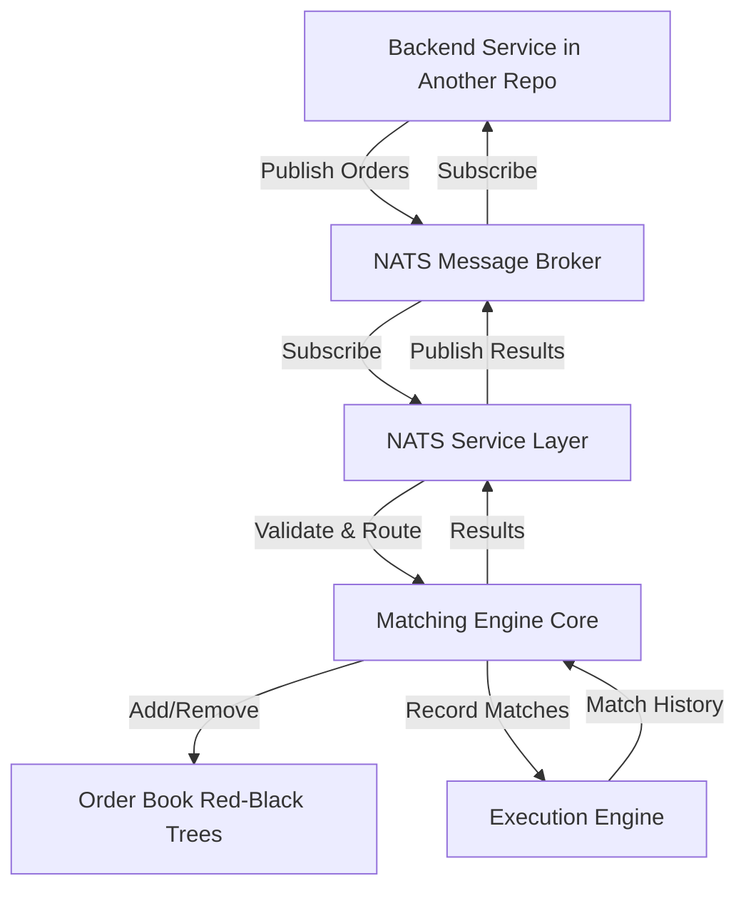
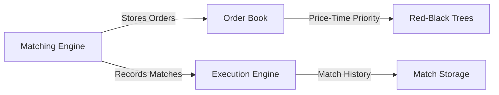
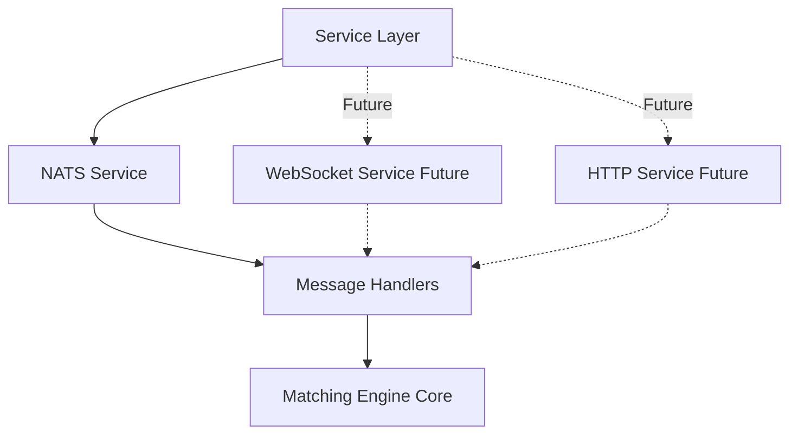
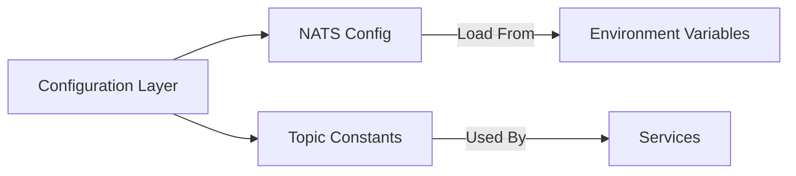
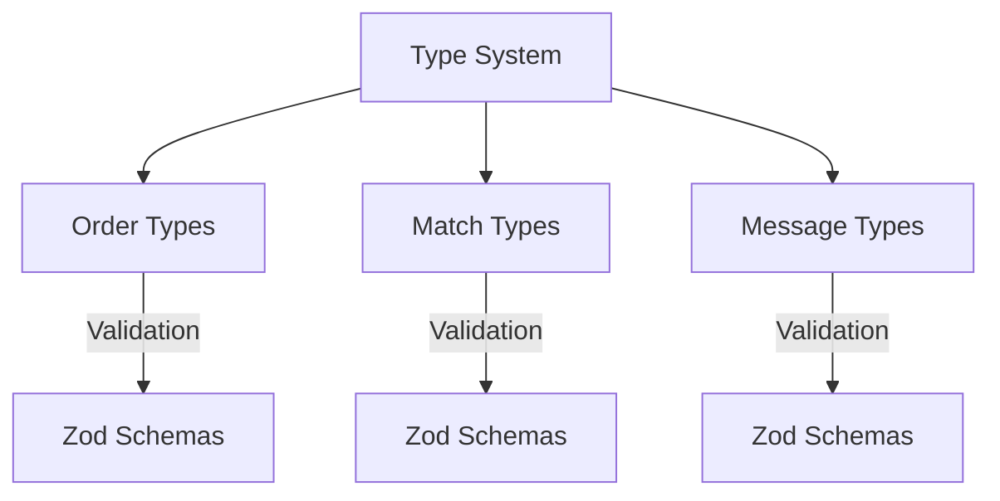
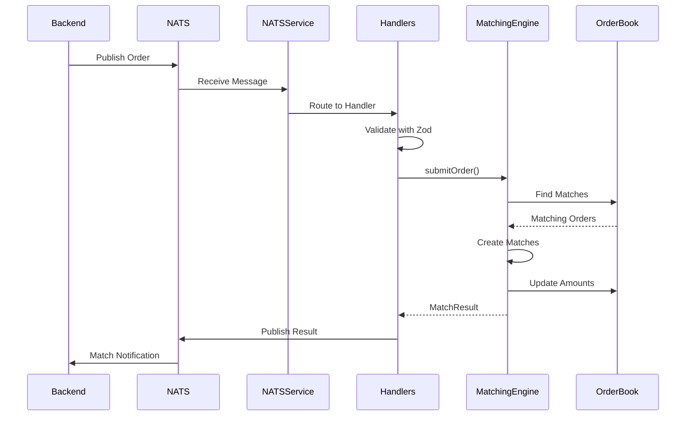
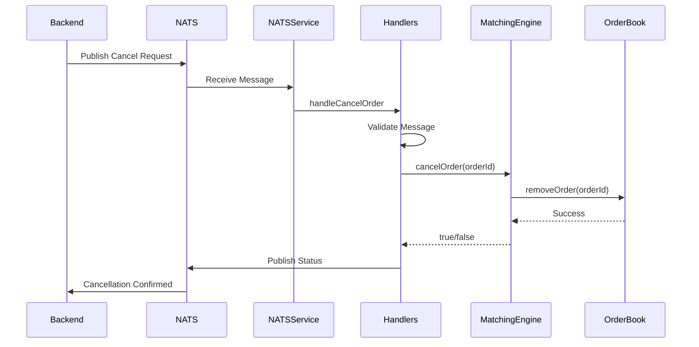
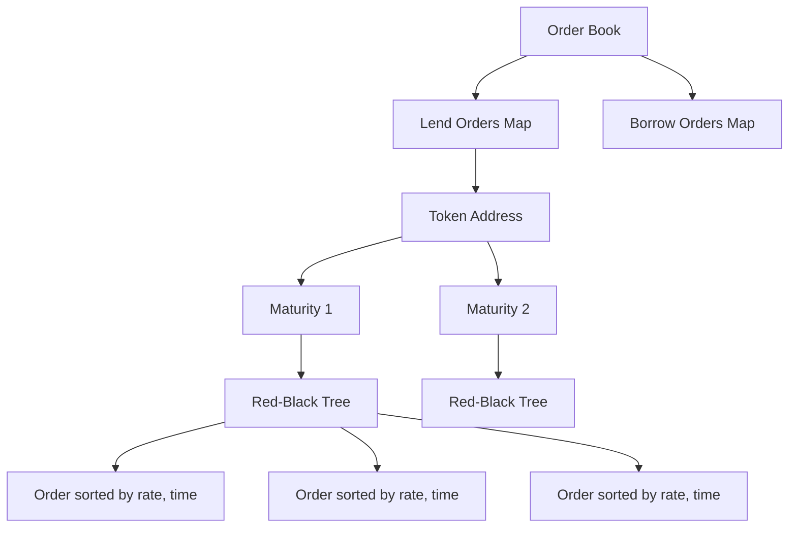
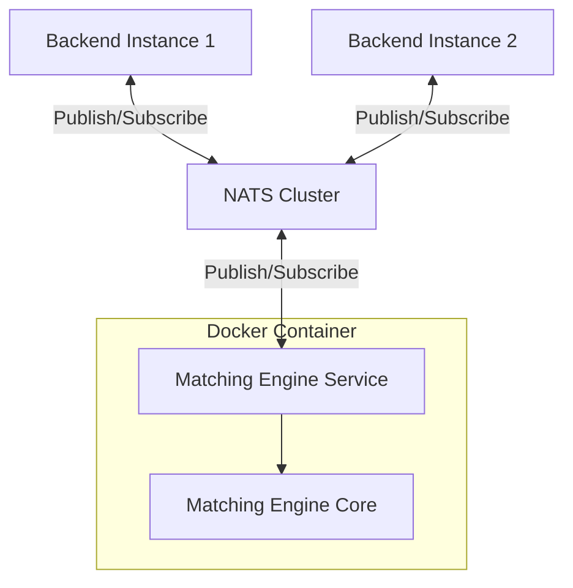
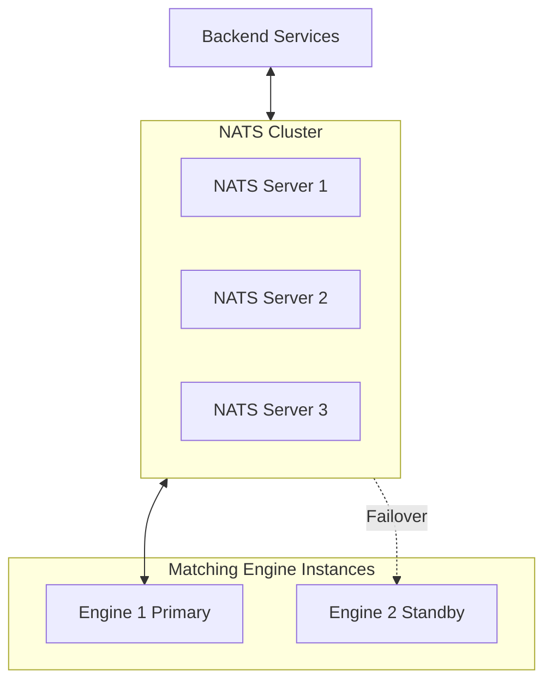

# Matching Engine Architecture

## System Overview



## Component Architecture

### Core Layer

The core matching engine components that handle order matching logic:



**Files**:
- `src/core/matching-engine.ts` - Core matching logic
- `src/core/order-book.ts` - Order storage with Red-Black Trees
- `src/core/execution-engine.ts` - Match recording and history

### Service Layer

Transport-agnostic services that can be used for different communication protocols:



**Files**:
- `src/services/nats-service.ts` - NATS connection & subscription management
- `src/services/message-handlers.ts` - Message processing logic (reusable)
- `src/services/main.ts` - Service entry point

### Configuration Layer



**Files**:
- `src/config/nats-config.ts` - NATS configuration management

### Type System



**Files**:
- `src/types/orders.ts` - Order type definitions and schemas
- `src/types/matches.ts` - Match result types and schemas
- `src/types/messages.ts` - NATS message types and schemas

## Data Flow

### Order Submission Flow



### Order Cancellation Flow



## Matching Algorithm

### Price-Time Priority

Orders are matched using price-time priority:

1. **Best Price First**: Orders with the best rate are matched first
2. **Time Priority**: Among orders at the same price, earlier orders match first

### Red-Black Tree Structure



**Structure**: `Map<loanToken, Map<maturity, RBTree<Order>>>`

**Benefits**:
- O(log n) insertion
- O(log n) deletion
- O(log n) lookup
- Automatic sorting by comparator

### Matching Logic

**Lend Limit Order** (wants to lend at ≥ rate):
1. Look for borrow orders with rate ≥ lend order rate
2. Execute at borrower's rate (maker rate)
3. Match until lend order is filled or no more matches

**Borrow Limit Order** (wants to borrow at ≤ rate):
1. Look for lend orders with rate ≤ borrow order rate
2. Execute at lender's rate (maker rate)
3. Match until borrow order is filled or no more matches

**Market Orders** (Immediate-or-Cancel):
1. Match at best available rates
2. Execute fully or partially
3. Cancel any remaining amount (not added to book)

## NATS Topic Architecture

### Topic Naming Convention

Format: `{category}.{side}.{type}` or `{category}.{action}`

### Topic Map

```
Input Topics (Subscribe):
├── orders.lend.market      → handleLendMarketOrder
├── orders.lend.limit       → handleLendLimitOrder
├── orders.borrow.market    → handleBorrowMarketOrder
├── orders.borrow.limit     → handleBorrowLimitOrder
└── orders.cancel           → handleCancelOrder

Output Topics (Publish):
├── matches.created         ← Match results
├── orders.status           ← Status updates
├── orderbook.snapshot      ← Book snapshots
└── errors                  ← Error notifications
```

## Deployment Architecture

### Standalone Service



### High Availability



## Performance Characteristics

| Operation | Time Complexity | Notes |
|-----------|----------------|-------|
| Add Order | O(log n) | Red-Black Tree insertion |
| Remove Order | O(log n) | Red-Black Tree deletion |
| Find Best Match | O(log n) | Tree iterator |
| Match Order | O(m log n) | m matches, each O(log n) |
| Get Order Status | O(1) | Hash map lookup |
| Cancel Order | O(log n) | Tree deletion + map lookup |

## Security Considerations

### Message Validation

1. **Schema Validation**: All messages validated with Zod
2. **Token Address Validation**: Ethereum address format checked
3. **Amount Validation**: Positive BigInt enforcement
4. **Rate Validation**: Non-negative integer for limit orders

### Authentication

- NATS supports user/password or token authentication
- Configure via environment variables
- No authentication required for local development

### Error Handling

- All errors caught and published to `errors` topic
- Standardized error codes and messages
- No sensitive data in error messages
- Detailed logging for debugging

## Monitoring & Observability

### Current Logging

- Service lifecycle events
- Order processing events
- Match creation events
- Error events

### Future Enhancements

- Prometheus metrics endpoint
- Order throughput metrics
- Match rate metrics
- Latency histograms
- Active order count gauges
- Error rate counters

## Extension Points

The modular architecture provides clear extension points:

### 1. New Transport Layer

Add new service in `src/services/`:
- Reuse `message-handlers.ts`
- Share `MatchingEngine` instance
- Follow same pattern as `nats-service.ts`

Example: `websocket-service.ts`

### 2. New Message Types

Add to `src/types/messages.ts`:
- Define Zod schema
- Export TypeScript type
- Add handler in `message-handlers.ts`
- Subscribe in service

### 3. New Matching Logic

Extend `matching-engine.ts`:
- Add new order types in `types/orders.ts`
- Implement matching method
- Add handler for new order type
- Add tests

### 4. Middleware

Add processing layers:
- Rate limiting
- Authentication/Authorization
- Request logging
- Metrics collection
- Message enrichment

## Summary

The architecture is designed to be:

✅ **Modular** - Clear separation of concerns
✅ **Extensible** - Easy to add new features
✅ **Testable** - Components can be tested independently
✅ **Production-Ready** - Error handling, logging, graceful shutdown
✅ **Performant** - O(log n) operations with Red-Black Trees
✅ **Type-Safe** - Zod validation + TypeScript
✅ **Scalable** - Can handle high message throughput

The core matching engine is completely decoupled from the transport layer, making it easy to add WebSocket, HTTP, or any other communication protocol in the future.

